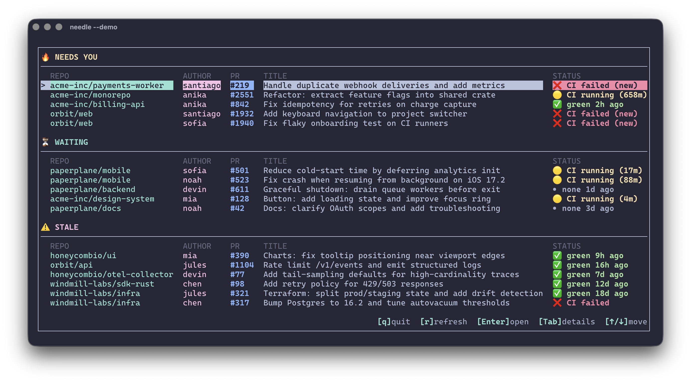

<div align="center">
  <h1>needle</h1>
  <p>
    <strong>TUI PR triage for GitHub</strong><br/>
    Shows the few PRs that need you: review requests, failing CI, and long-running checks.
  </p>

  <p>
    <a href="https://www.rust-lang.org/"></a>
    <a href="https://crates.io/crates/needle-cli"></a>
    
    
    
    
  </p>

  
</div>

Open PRs (and individual CI checks) in your browser. Not a full GitHub client—just a focused attention filter.

## Install

```bash
cargo install needle-cli
```

This installs the `needle` binary.

## Quick start

Demo mode (no GitHub token required):

```bash
needle --demo
```

Real mode (requires `GITHUB_TOKEN`):

```bash
export GITHUB_TOKEN=...
needle
```

## Options

- `--days <N>`: only include PRs updated in the last `N` days (default: `30`)
- `--demo`: run with diverse fake data

```bash
needle --days 7
```

## Requirements (real mode)

- Rust (stable)
- A GitHub Personal Access Token in `GITHUB_TOKEN`

## Get a GitHub token

Needle uses the GitHub API, so you’ll need a Personal Access Token.

1. Go to `https://github.com/settings/tokens?type=beta` and create a **Fine-grained** token.
2. Choose the account/organization that owns the repos you want to scan.
3. Set **Repository access** to “All repositories” (or select specific repos).
4. Add **Pull requests: Read-only** permissions.
5. Copy the token and export it:

```bash
export GITHUB_TOKEN="ghp_..."
```

## What it shows (V1 scope)

Included PRs:
- PRs **authored by you**
- PRs where **you are explicitly requested as a reviewer (User)**  
  (team review requests are ignored)

For each PR it computes:
- Latest commit SHA
- CI state (success/failure/running/none)
- Review request state (requested/approved/none)
- A hard-coded score → sorted desc → grouped into categories

## Controls

List view:
- `↑ / ↓`: move selection
- `Enter`: open selected PR in default browser (persists `last_opened_at`)
- `Tab`: open details view
- `r`: refresh now (shows shimmer while refreshing)
- `q`: quit

Details view:
- `↑ / ↓`: select CI check
- `Enter`: open selected CI check page (falls back to PR URL)
- `Tab`: back to list
- `r`: refresh now
- `q`: quit

## UI

- Single-screen list, visually grouped by derived category:
  - **NEEDS YOU** (score >= 40)
  - **WAITING** (0..39)
  - **STALE** (< 0)
- Empty sections are hidden.
- Rows are dimmed if `last_opened_at` is recent.
- No scrolling beyond terminal height (truncates to fit).
- Uses cached SQLite data to render immediately, then refreshes in the background.

### Details view CI checks

In details view you get a list of CI steps (check runs / status contexts):
- ✅ success
- ❌ failed
- 🟡 running (shows “running for …” when `startedAt` is available)

## Refresh behavior

- Fetches on startup **in the background** (UI shows cached data immediately).
- Manual refresh: `r`
- Auto refresh: every **30s** while on the details view
- No background async tasks beyond the single refresh worker thread.

## Scoring (hard-coded)

Each PR gets a score (higher = more urgent):

```
+50  review requested from user
+40  CI failed AND state changed since last_seen
+20  CI running longer than 10 minutes
+15  approved but unmerged for >24h
-20  waiting on others (no review requested, CI green)
-30  CI failed but unchanged since last_seen
```

Sort:
- Score desc
- Then by updated timestamp desc

## Troubleshooting

- **Missing token**: set `GITHUB_TOKEN`.
- **Not a TTY**: run in an interactive terminal (not a non-tty runner).

## License

MIT. See `LICENSE`.
