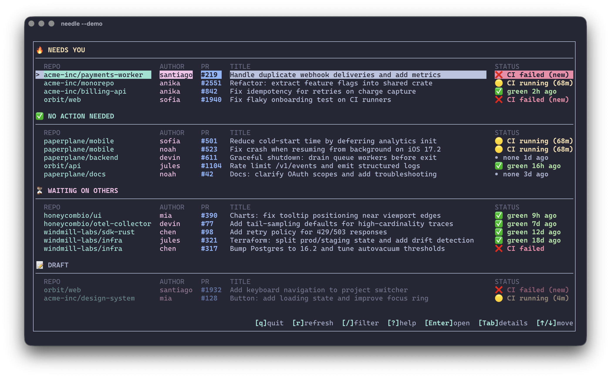

<div align="center">
  <h1>needle</h1>
  <p>
    TUI that shows the few PRs that need you: review requests, failing CI, and long-running checks.
  </p>

  <p>
    <a href="https://github.com/cesarferreira/needle/actions/workflows/ci.yml"></a>
    <a href="https://crates.io/crates/needle-cli"></a>
    
    
    
    
  </p>

  
</div>


## Install

```bash
cargo install needle-cli
```

This installs the `needle` binary.

## Quick start

Demo mode (no GitHub token required):

```bash
needle --demo
```

Real mode (requires `NEEDLE_GITHUB_TOKEN` or `GITHUB_TOKEN`):

```bash
export NEEDLE_GITHUB_TOKEN=ghp_...
# or
export GITHUB_TOKEN=ghp_...
needle
```

## Options

- `--days <N>`: only include PRs updated in the last `N` days (default: `30`)
- `--demo`: run with diverse fake data
- `--org <ORG>`: only show PRs in these orgs/users (repeatable or comma-delimited)
- `--include <owner/repo>`: only show these repos (repeatable or comma-delimited)
- `--exclude <owner/repo>`: hide these repos (repeatable or comma-delimited)
- `--include-team-requests`: include PRs requested to teams you are in (default: user-only)
- `--bell`: ring terminal bell when a PR enters **NEEDS YOU** or when CI fails (new)
- `--no-notifications`: disable desktop notifications (enabled by default)
- `--hide-pr-numbers`: hide PR numbers column
- `--hide-repo`: hide repository column
- `--hide-author`: hide author column
- `--no-cache`: start empty (skip cached PRs) and rely on fresh refresh
- `--purge-cache`: delete the cache DB before starting (also works with `--demo`)

```bash
needle --days 7
```

## Desktop Notifications

Needle shows desktop notifications for important events like CI failures, review requests, and PRs ready to merge.


On macOS, install [terminal-notifier](https://github.com/julienXX/terminal-notifier) for click-to-open support:

```bash
brew install terminal-notifier
```

With `terminal-notifier` installed, clicking a notification opens the PR in your browser. Without it, notifications still work but won't be clickable.

## Requirements

- Rust (stable)
- A GitHub Personal Access Token in `NEEDLE_GITHUB_TOKEN` or `GITHUB_TOKEN`

## Get a GitHub token

Needle uses the GitHub API, so you’ll need a Personal Access Token.

1. Go to https://github.com/settings/tokens?type=beta and create a **Fine-grained** token.
2. Choose the account/organization that owns the repos you want to scan.
3. Set **Repository access** to “All repositories” (or select specific repos).
4. Add **Pull requests: Read-only** permissions.
5. Copy the token and export it:

```bash
export NEEDLE_GITHUB_TOKEN="ghp_..."
# or
export GITHUB_TOKEN="ghp_..."
```

> [!NOTE]
> If both are set, `NEEDLE_GITHUB_TOKEN` takes priority.

Add it to your bashrc/zshrc for future usage.

## What it shows

Included PRs:
- PRs **authored by you**
- PRs where **you are explicitly requested as a reviewer (User)**  
  (team review requests are ignored unless `--include-team-requests`)

For each PR it computes:
- Latest commit SHA
- CI state (success/failure/running/none)
- Review request state (requested/approved/none)
- A hard-coded score → sorted desc → grouped into categories

## Controls

List view:
- `↑ / ↓`: move selection
- `Enter`: open selected PR in default browser
- `Tab`: open details view
- `/`: filter mode (type to filter by repo/title/author/#)
  - `Esc`: exit filter mode + clear filter text
  - `Ctrl+n`: toggle “only NEEDS YOU”
  - `Ctrl+c`: toggle “only failing CI”
  - `Ctrl+v`: toggle “only review requested”
  - `Ctrl+x`: clear all filters
- `?`: help (explains what each section means)
- `r`: refresh now (shows shimmer while refreshing)
- `q`: quit

Details view:
- `↑ / ↓`: select CI check
- `Enter`: open selected CI check page (falls back to PR URL)
- `f`: open first failing CI check (falls back to PR URL)
- `Tab`: back to list
- `r`: refresh now
- `q`: quit

### Details view CI checks

In details view you get a list of CI steps (check runs / status contexts):
- ✅ success
- ❌ failed
- 🟡 running (shows “running for …” when `startedAt` is available)

## Refresh behavior

- Fetches on startup **in the background** (UI shows cached data immediately).
- Manual refresh: `r`
- Auto refresh in list view: every **3 minutes**
- Auto refresh in details view: every **30s**
- Manual refresh resets the auto-refresh timer.
- No background async tasks beyond the single refresh worker thread.

## Scoring

- Single-screen list, visually grouped by derived category:
  - **NEEDS YOU** (score >= 40)
  - **READY TO MERGE** (your PR, CI green, no blockers)
  - **DRAFT** (draft PRs; shown separately and dimmed)
  - **NO ACTION NEEDED** (0..39)
  - **WAITING ON OTHERS** (< 0)
- Empty sections are hidden.
- Draft rows are dimmed.
- No scrolling beyond terminal height (truncates to fit).
- Uses cached SQLite data to render immediately, then refreshes in the background.

Each PR gets a score (higher = more urgent):

```
+50  review requested from user
+40  CI failed AND state changed since last_seen
+20  CI running longer than 10 minutes
+15  approved but unmerged for >24h
-20  waiting on others (no review requested, CI green, not approved)
-30  CI failed but unchanged since last_seen
```

Sort:
- Score desc
- Then by updated timestamp desc

## Troubleshooting

- **Missing token**: set `GITHUB_TOKEN`.
- **Not a TTY**: run in an interactive terminal (not a non-tty runner).

## License

MIT. See `LICENSE`.
